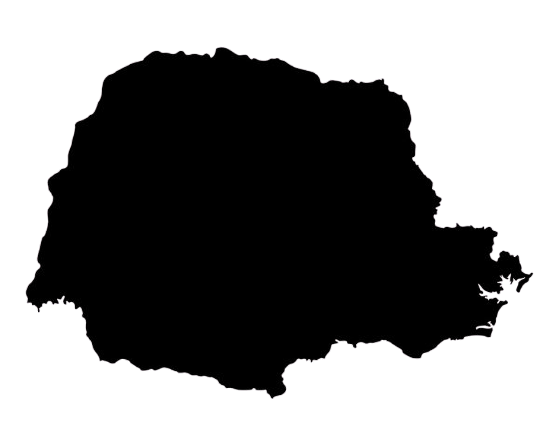

```{r, include=FALSE}
## CONFIGURAÇÕES NO R
options(OutDec = ",",knitr.kable.NA='',digits=2)
knitr::opts_chunk$set(warning = F, message = F)
## PACOTES
pkg <- c("readr","readxl","lubridate","stringr","dplyr","knitr","ggplot2","gganimate","gifski","grid","magick","scales","plotly")
sapply(pkg, require, character.only=TRUE)

```

```{r include=FALSE}
path <- "./assets/csv/base.xlsx"

library(readxl)
Cesta <- read_excel(path, 
    skip = 5,sheet = "CONSOLIDADO")
Cesta1 <- read_excel(path, 
    skip = 5,sheet = "2020 valores coletados",range = "B169:U182")
Cesta2 <- read_excel(path, 
    skip = 5,sheet = "2020 valores coletados",range = "B151:U164")
valor <- as.numeric(Cesta$OUT[Cesta$PRODUTOS=="TOTAL"][1])
Cesta3 <- read_excel(path,sheet = "grafico variação mensal")
#-----------------------------------------------------

# cesta_atual = read.csv(file = "./assets/csv/atual.csv", sep = ";")
# cesta_passd = read.csv(file = "./assets/csv/passd.csv", sep = ";")

# Reducao, Igual, Aumento
Prod <- read_excel(path, 
    skip = 0,sheet = "grafico de preços ",range = "B167:C180")
reducao <- Prod$`Produtos resumido`[Prod$`Var MM%`< -0.01]
igual <- Prod$`Produtos resumido`[abs(Prod$`Var MM%`)<= 0.01]
aumento <- Prod$`Produtos resumido`[Prod$`Var MM%`> 0.01]

aumento_reducao <- ifelse(as.numeric(Cesta$OUT[Cesta$PRODUTOS=="TOTAL"][1])>as.numeric(Cesta$SET[Cesta$PRODUTOS=="TOTAL"][1]), "aumento", "redução")

delta_percent <- round(abs(as.numeric(Cesta$OUT[Cesta$PRODUTOS=="variação em relação ao mês anterior"][2])*100),1)

# Valor da cesta p/ 1 pessoa e 1 familia (2A 2C)

# Totais das cestas
total_anterior <- as.numeric(Cesta$SET[Cesta$PRODUTOS=="TOTAL"][1])
total_atual <- as.numeric(Cesta$OUT[Cesta$PRODUTOS=="valor da cesta para uma pessoa"][2])
# p/ familia = *3
total_atual_familia <- as.numeric(Cesta$OUT[Cesta$PRODUTOS=="valor da cesta para uma família padrão"][2])

# Melhores e piores
melhor_mercado_total <- round(abs(as.numeric(Cesta$OUT[Cesta$PRODUTOS=="variação em relação ao mês anterior"][2]))*100,1)

melhor_preco_percent <- round(abs(as.numeric(Cesta$OUT[Cesta$PRODUTOS=="economia percentual menores preços sobre valor da cesta média"][2]))*100,1)

melhor_preco_total <- as.numeric(Cesta$OUT[Cesta$PRODUTOS=="composição da cesta com os menores preços"][2])

#--------------------------------------------


```


# Introdução

:::::: {.cols data-latex=""}
::: {.col data-latex="{0.45\textwidth}"}

O Objetivo desta pesquisa é identificar a variação de preços ocorrida na cidade de Londrina, sobre os produtos que compõe a cesta básica, que é definida pelo Decreto 399 de 1938 e que continua em vigência. Levantamento realizado em 31 de outubro, nas 11 redes supermercadistas que atuam em Londrina, considerando unidades


:::


::: {.col data-latex="{0.1\textwidth}"}
\ 
<!-- Um espaço entre colunas -->
:::


::: {.col data-latex="{0.45\textwidth}"}

nos quatro pontos cardeais e mais o centro da cidade, com os 13 produtos que compõem a cesta básica. São levantados os preços dos produtos que apresentam o menor valor e não são consideradas as marcas. Série histórica iniciada em maio de 2001 pelo professor Flavio de Oliveira Santos.  

:::
::::::


# Resultados

## Levantamento em outubro de 2020

\vspace{5mm}

:::::: {.cols data-latex=""}
::: {.col data-latex="{0.45\textwidth}"}


O valor da cesta básica calculada pela média destes 11 supermercados apresentou `r aumento_reducao` de **`r delta_percent`\%** em comparação com o mês anterior, cujo
:::

::: {.col data-latex="{0.1\textwidth}"}
\ 
<!-- Um espaço entre colunas -->
:::


::: {.col data-latex="{0.45\textwidth}"}
levantamento apontava o valor médio de **R\$ `r total_anterior`** (set/2020).

:::
::::::

\vspace{7mm}

\begin{center}
\bf{\color{red}{VALORES DA CESTA}}
\end{center}  


:::::: {.cols data-latex=""}
::: {.col data-latex="{0.2\textwidth}"}
\ 
<!-- Um espaço entre colunas -->
:::


::: {.col data-latex="{0.2\textwidth}"}


```{r, out.width = "70px",echo=F}

```
:::

::: {.col data-latex="{0.5\textwidth}"}

\vspace{-6mm}

\begin{center}
Para uma pessoa adulta:
\vspace{.5mm}

\bf{R\$`r  total_atual`}
\end{center}

\vspace{3mm}

\begin{center}
Para uma Família (dois adultos e duas crianças):

\vspace{0.5mm}

\bf{R\$`r  total_atual_familia`}
\end{center}

\vspace{7mm}

\begin{center}
Variação em relação ao mês anterior:  
\vspace{.5mm}

\bf{`r  delta_percent`\%}  
\end{center}
:::
::::::

:::::: {.cols data-latex=""}

::: {.col data-latex="{0.45\textwidth}"}

Este é o valor médio (**R\$`r valor_atual`**) obtido a partir dos
preços dos onze supermercados. No entanto, se o
consumidor se dispusesse a adquirir os produtos de
menor preço em cada um dos supermercados
pesquisados, conseguiria esta mesma cesta **`r  melhor_preco_percent`\%** mais barata, ou seja, pagaria **R\$`r melhor_preco_total`**.

:::


::: {.col data-latex="{0.10\textwidth}"}
\ 
<!-- Um espaço entre colunas -->
:::


::: {.col data-latex="{0.45\textwidth}"}

Mas, em uma situação mais real, se o consumidor
comprar todas as mercadorias que compõe a cesta
básica no supermercado que apresenta os menores
preços pagará por ela **R\$`r melhor_mercado_total`**  ou **`r round(abs(as.numeric(Cesta$OUT[Cesta$PRODUTOS=="diferença do menor preço em relação ao valor médio"][8]))*100,1)`\%** mais
barato que a média, porém,se comprar naquele que
estiver mais caro, pagará **R\$ `r as.numeric(Cesta$OUT[Cesta$PRODUTOS=="supermercado com o maior preço da cesta"][8])`**, **`r round(abs(as.numeric(Cesta$OUT[Cesta$PRODUTOS=="diferença do maior preço em relação ao valor médio"][8]))*100,1)`%** mais caro
que a média.

:::
::::::

\vspace{7mm}

\begin{center}
\bf{\color{red} VARIAÇÃO DOS PREÇOS DA CESTA}
\end{center}

:::::: {.cols data-latex=""}
::: {.col data-latex="{0.2\textwidth}"}
\ 
<!-- Um espaço entre colunas -->
:::


::: {.col data-latex="{0.2\textwidth}"}

\vspace{-7mm}


```{r, out.width = "50px",echo=F}

```

:::

::: {.col data-latex="{0.5\textwidth}"}

\vspace{5mm}

Menor preço de cada item:     

\vspace{1mm}

**R$ `r as.numeric(Cesta$OUT[Cesta$PRODUTOS=="composição da cesta com os menores preços"][2])`** -> **`r  round(abs(as.numeric(Cesta$OUT[Cesta$PRODUTOS=="economia percentual menores preços sobre valor da cesta média"][2]))*100,1)`%***  

\vspace{15mm}

Supermercado mais barato:    

\vspace{1mm}

**R$ `r as.numeric(Cesta$OUT[Cesta$PRODUTOS=="supermercado com menor preço da cesta"][8])`** -> **`r round(abs(as.numeric(Cesta$OUT[Cesta$PRODUTOS=="diferença do menor preço em relação ao valor médio"][8]))*100,1)`%**    

\vspace{4mm}

Supermercado mais caro:  

\vspace{1mm}

**R$ `r as.numeric(Cesta$OUT[Cesta$PRODUTOS=="supermercado com o maior preço da cesta"][8])`** -> **`r round(abs(as.numeric(Cesta$OUT[Cesta$PRODUTOS=="diferença do maior preço em relação ao valor médio"][8]))*100,1)`%**    

\vspace{5mm}

\* Variação em relação ao valor médio.

:::
::::::

\vspace{5mm}

## Produtos com maior variação nos preços

\vspace{5mm}


:::::: {.cols data-latex=""}

::: {.col data-latex="{0.45\textwidth}"}

De todos os 13 itens que compõem a cesta básica
nacional, `r length(aumento)` apresentaram aumento nos preços em relação ao mês anterior, foram eles: `r aumento`.
:::

::: {.col data-latex="{0.1\textwidth}"}
\ 
<!-- Um espaço entre colunas -->
:::

::: {.col data-latex="{0.45\textwidth}"}

Permaneceu estável (variação menor que 1\%) somente `r igual` e `r length(reducao)` itens que compõe a cesta
básica apresentaram redução nos preços, que foram: `r reducao`.

:::
::::::


:::::: {.cols data-latex=""}

::: {.col data-latex="{0.45\textwidth}"}

\vspace{.5cm}

\begin{center}
\bf{Produtos com maior redução}
\end{center}
:::

::: {.col data-latex="{0.1\textwidth}"}
\ 
<!-- Um espaço entre colunas -->
:::


::: {.col data-latex="{0.45\textwidth}"}

\vspace{.5cm}

\begin{center}
\bf {Produtos com maior aumento}
\end{center}

:::
::::::


:::::: {.cols data-latex=""}

::: {.col data-latex="{0.225\textwidth}"}

```{r, echo=F}
pr1 <- head(Prod$`Produtos resumido`,n = 3)[1] 
vl1 <- head(Prod$`Var MM%`,n=3)[1]*100
pr2 <- head(Prod$`Produtos resumido`,n = 3)[2] 
vl2 <- head(Prod$`Var MM%`,n=3)[2]*100
pr3 <- head(Prod$`Produtos resumido`,n = 3)[3] 
vl3 <- head(Prod$`Var MM%`,n=3)[3]*100
```

\begin{center}

`r pr1`  
\vspace{.1cm}

*`r round((vl1),1)`\%*

\vspace{.4cm}

`r pr2`    
\vspace{.1cm}

`r round((vl2),1)`\%
\vspace{.4cm}

`r pr3` 
\vspace{.1cm}

**`r round((vl3),1)`\%**

\end{center}

:::

::: {.col data-latex="{0.225\textwidth}"}

\vspace{.2cm}

```{r, out.width = "50px",echo=F}
fig1 <- str_c("assets/img/",pr1)
knitr::include_graphics(str_c(fig1,".png"))
```
\vspace{.2cm}

```{r, out.width = "50px",echo=F}
fig2 <- str_c("assets/img/",pr2)
knitr::include_graphics(str_c(fig2,".png"))
```
\vspace{.1cm}

```{r, out.width = "50px",echo=F}
fig3 <- str_c("assets/img/",pr3)
knitr::include_graphics(str_c(fig3,".png"))
```

:::


::: {.col data-latex="{0.1\textwidth}"}
\ 
<!-- Um espaço entre colunas -->
:::


::: {.col data-latex="{0.225\textwidth}"}

```{r, echo=F}
pr4 <- tail(Prod$`Produtos resumido`,n = 3)[3] 
vl4 <- tail(Prod$`Var MM%`,n=3)[3]*100
pr5 <- tail(Prod$`Produtos resumido`,n = 3)[2] 
vl5 <- tail(Prod$`Var MM%`,n=3)[2]*100
pr6 <- tail(Prod$`Produtos resumido`,n = 3)[1] 
vl6 <- tail(Prod$`Var MM%`,n=3)[1]*100
```

\vspace{.5cm}

\begin{center}


```{r, out.width = "50px",echo=F}
fig4 <- str_c("assets/img/",pr4)
knitr::include_graphics(str_c(fig4,".png"))
```
\vspace{.1cm}

```{r, out.width = "50px",echo=F}
fig5 <- str_c("assets/img/",pr5)
knitr::include_graphics(str_c(fig5,".png"))
```
\vspace{.1cm}

```{r, out.width = "50px",echo=F}
fig6 <- str_c("assets/img/",pr6)
knitr::include_graphics(str_c(fig6,".png"))
```

\end{center}

:::

::: {.col data-latex="{0.20\textwidth}"}

\begin{center}

`r pr4`  
\vspace{.1cm}

`r round((vl4),1)`\%

\vspace{.4cm}

`r pr5`     
\vspace{.1cm}

`r round((vl5),1)`\%

\vspace{.4cm}

`r pr6`  
\vspace{.1cm}

`r round((vl6),1)`\%

\end{center}


:::
::::::


:::::: {.cols data-latex=""}
::: {.col data-latex="{0.45\textwidth}"}

A carne, que é o produto que tem maior peso na cesta básica (neste mês, `r round(as.numeric(Cesta$OUT[Cesta$PRODUTOS=="Carne"][1])/as.numeric(Cesta$OUT[Cesta$PRODUTOS=="TOTAL"][1])*100,1)`%), se manteve estável com variação igual a `r round(as.numeric(Prod$"Var MM%"[Prod$"Produtos resumido"=="Carne"]*100),1)`%, ou seja, menor que 1\%, ficando na média de R\$  `r as.numeric(Cesta1$Média[Cesta1$Produtos=="Carne 1 kg"])` o quilo. Lembrando que no mês passado estava a R\$ `r as.numeric(Cesta2$Média[Cesta2$Produtos=="Carne 1 kg"])` na média.
:::

::: {.col data-latex="{0.1\textwidth}"}
\ 
<!-- Um espaço entre colunas -->
:::


::: {.col data-latex="{0.45\textwidth}"}
O preço mais barato encontrado foi de R\$ `r as.numeric(Cesta1$Golff[Cesta1$Produtos=="Carne 1 kg"])` e o mais elevado de R\$ `r as.numeric(Cesta1$Musa[Cesta1$Produtos=="Carne 1 kg"])`. A carne tem como referência sempre o coxão mole e se a peça tiver menor preço que fatiado é considerado o preço da peça.  

:::
::::::


:::::: {.cols data-latex=""}

::: {.col data-latex="{0.3\textwidth}"}
\ 
<!-- Um espaço entre colunas -->
:::


::: {.col data-latex="{0.2\textwidth}"}

```{r, out.width = "80px",echo=F}
pr7 <- as.character(str_split(sort(reorder(Cesta1$Produtos,Cesta1$Maior),decreasing = T)[1]," ")[[1]][1])
vl7 <- round(Prod$`Var MM%`[Prod$`Produtos resumido`==pr7]*100,1)
fig7 <- str_c("assets/img/",pr7)
knitr::include_graphics(str_c(fig7,".png"))
```
:::

::: {.col data-latex="{0.1\textwidth}"}
`r pr7`  
**`r round(vl7,1)`%**
:::

::: {.col data-latex="{0.01\textwidth}"}
```{r, out.width = "70px",echo=F,fig.align="left"}
knitr::include_graphics("assets/img/setacima.png",)
```
:::

::::::


```{r, echo=FALSE,fig.align="center",out.width = "500px"}
names(Prod)<- c("Produtos.resumido","Var.MM.")
max <- max(Prod$Var.MM.)
min <- min(Prod$Var.MM.)
igual <- Prod$`Produtos resumido`[abs(Prod$Var.MM.)<= 0.01]
aumento <- Prod$`Produtos resumido`[Prod$Var.MM.> 0.01]
Prod$var = as.factor(ifelse(Prod$Var.MM.< -0.01, yes = -1, no = ifelse(abs(Prod$Var.MM.)<= 0.01,0,1)))
ggplot(Prod, aes(x=reorder(Produtos.resumido, Var.MM.), y=Var.MM.)) +
  geom_col(aes(fill=var)) +
  coord_flip(ylim = c(min-0.1,max+0.1)) +
 scale_fill_manual(values = c("green","orange", "red")) +
  scale_y_continuous(labels = scales::percent) +
  scale_x_discrete(labels= NULL)+
  labs(y = "", x = "") +
  geom_text(data = Prod[Prod$Var.MM. < -0.01,],
            aes(label = factor(Produtos.resumido), size=5,y=0.1))+
  geom_text(data=Prod[c(Prod$Var.MM.< 0.01 & Prod$Var.MM.> 0),],
            aes(label = factor(Produtos.resumido),size=5,y=-0.1))+
  geom_text(data=Prod[c(Prod$Var.MM.> -0.01 & Prod$Var.MM.< 0),],
            aes(label = factor(Produtos.resumido), size=5,y=0.1))+
  geom_text(data = Prod[Prod$Var.MM. > 0.01,],
            aes(label = factor(Produtos.resumido),size=5,y=-0.1))+
  geom_text(data = Prod[Prod$Var.MM. < -0.01,], 
            aes(label=scales::percent(Var.MM.,decimal.mark = ","), size = 5, hjust=1))+
  geom_text(data=Prod[c(Prod$Var.MM.< 0.01 & Prod$Var.MM. > 0),],             aes(label=scales::percent(Var.MM.,decimal.mark = ","), size = 5, hjust=0))+
  geom_text(data=Prod[c(Prod$Var.MM.> -0.01 & Prod$Var.MM. < 0),],             aes(label=scales::percent(Var.MM.,decimal.mark = ","), size = 5, hjust=1))+
  geom_text(data = Prod[Prod$Var.MM. > 0.01,], 
            aes(label=scales::percent(Var.MM.,decimal.mark = ","), size = 5, hjust=0))+
  theme(
    legend.position = "none",
    axis.text.x = element_text(size=15),
    axis.text.y = element_blank(),
    axis.ticks.y = element_blank(),
    panel.background = element_rect(fill = "#E4E4E4",color=NA), # bg of the panel
    plot.background = element_rect(fill = "#E4E4E4",color = NA), # bg of the plot
    panel.grid.major = element_blank(), # get rid of major grid
    panel.grid.minor = element_blank(), # get rid of minor grid
    legend.background = element_rect(fill = "#E4E4E4"), # get rid of legend bg
    legend.box.background = element_rect(fill = "#E4E4E4"), # get rid of legend panel bg
    legend.key = element_rect(fill = "#E4E4E4"), # get rid of key legend fill, and of the surrounding
    axis.line = element_line(colour = "#E4E4E4"))+
  ggtitle("Variação em relação ao mês anterior")
```


## Comportamento dos preços sobre outubro/2020

\vspace{5mm}

:::::: {.cols data-latex=""}

::: {.col data-latex="{0.45\textwidth}"}

Quando comparado com o valor da cesta básica de outubro do ano passado, esta mostrou um aumento de `r round(as.numeric(Cesta$OUT[Cesta$PRODUTOS=="variação em relação ao mesmo mês ano anterior"][2])*100,1)`%. Naquele mês ela foi adquirida 

:::

::: {.col data-latex="{0.1\textwidth}"}
\ 
<!-- Um espaço entre colunas -->
:::

::: {.col data-latex="{0.45\textwidth}"}

 pelo valor médio de R\$ 385,23. Na comparação com os preços praticados em 02 de janeiro, os preços da cesta básica apresentaram `r ifelse(as.numeric(Cesta$OUT[Cesta$PRODUTOS=="variação desde o inicio do ano"][2])>0, "alta", "baixa")` de `r round(abs(as.numeric(Cesta$OUT[Cesta$PRODUTOS=="variação desde o inicio do ano"][2]))*100,1)`%.
:::
::::::

```{r, echo=FALSE,fig.align="center",out.width = "500px"}
Cesta3 <- Cesta3[,c(1,2,3)]
df <- Cesta3
df <- df[complete.cases(df),]
lg <- nrow(df)
df <- df[-c(lg-12:lg),]
df$DATA <- as.Date(df$DATA)
df$var = as.factor(ifelse(df$VARIAÇÃO > 0, yes = 1, no = 0))
rm(lg, Cesta3)
p2 <- ggplot(df, aes(DATA,VARIAÇÃO)) +
  geom_col(aes(fill = var,
               text = paste0(
                 "Data: ", DATA, "\n",
                 "Variação: ", scales::percent(round(VARIAÇÃO,1),decimal.mark = ","), '\n',
                 "Valor: R$ ", round(VALOR,2), '\n'
               )),color="black")+
  geom_hline(yintercept = 0) +
  guides(fill = FALSE) +
  scale_fill_manual(values = c("firebrick", "dodgerblue4"))+
  scale_y_continuous(labels = percent_format(decimal.mark = ",",suffix = "%"))+
  scale_x_date(breaks=seq(min(df$DATA), max(df$DATA), by="1 month"),date_labels = "%b-%y")+
  labs(y = "", x = "") +
  theme(
    legend.position = "none",
  axis.text.x = element_text(size=8),
    axis.text.y = element_text(size=12),
    axis.ticks.y = element_blank(),
    panel.background = element_rect(fill = "#E4E4E4",color=NA), # bg of the panel
    plot.background = element_rect(fill = "#E4E4E4",color = NA), # bg of the plot
    panel.grid.major = element_blank(), # get rid of major grid
    panel.grid.minor = element_blank(), # get rid of minor grid
    legend.background = element_rect(fill = "#E4E4E4"), # get rid of legend bg
    legend.box.background = element_rect(fill = "#E4E4E4"), # get rid of legend panel bg
    legend.key = element_rect(fill = "#E4E4E4"), # get rid of key legend fill, and of the surrounding
    axis.line = element_line(colour = "#E4E4E4"))+
  ggtitle("Variação mensal da cesta básica em Londrina nos últimos 12 meses")
p2
```

## Cesta vs Salário Mínimo  

\vspace{5mm}

:::::: {.cols data-latex=""}

::: {.col data-latex="{0.45\textwidth}"}

Quando comparado o valor da cesta básica de outubro de 2020 com o mês anterior, percebe-se uma redução no poder de compra do assalariado, visto
que a compra desta mesma cesta exigia `r round(abs(as.numeric(Cesta$SET[Cesta$PRODUTOS=="percentual da jornada"][8]))*100,1)`% da jornada de trabalho de quem ganhava 
:::

::: {.col data-latex="{0.1\textwidth}"}
\ 
<!-- Um espaço entre colunas -->
:::

::: {.col data-latex="{0.45\textwidth}"}

um salário mínimo nacional e este tempo subiu para `r round(abs(as.numeric(Cesta$OUT[Cesta$PRODUTOS=="percentual da jornada"][8]))*100,1)`% da jornada. Em relação ao salário mínimo paranaense, exige `r round(abs(as.numeric(Cesta$OUT[Cesta$PRODUTOS=="percentual da jornada paranaese"][8]))*100,1)`% da jornada de trabalho, quando no mês passado foi de `r round(abs(as.numeric(Cesta$SET[Cesta$PRODUTOS=="percentual da jornada paranaese"][8]))*100,1)`% da jornada. 
:::
::::::

\newpage
  
\begin{center}
\bf{\color{red} Tempo necessário de trabalho para adquirir uma cesta básica}
\end{center}

:::::: {.cols data-latex=""}
::: {.col data-latex="{0.2\textwidth}"}
\ 
<!-- Um espaço entre colunas -->
:::


::: {.col data-latex="{0.2\textwidth}"}


```{r, out.width = "50px",echo=F}

```
\vspace{5mm}

```{r, out.width = "50px",echo=F}
knitr::include_graphics("assets/img/brasil.png")
```
:::


::: {.col data-latex="{0.3\textwidth}"}

\vspace{6mm}

\centering

Salário Mínimo Paranaense


(R\$`r as.numeric(Cesta$OUT[Cesta$PRODUTOS=="em relação ao salário minimo paranaense"][8])`)

**`r 220*as.numeric(Cesta$OUT[Cesta$PRODUTOS=="valor da cesta para uma pessoa"][2])/as.numeric(Cesta$OUT[Cesta$PRODUTOS=="em relação ao salário minimo paranaense"][8])` ->  `r round(abs(as.numeric(Cesta$OUT[Cesta$PRODUTOS=="percentual da jornada paranaese"][8]))*100,1)`%** 


\vspace{.8cm}


Salário Mínimo Brasileiro  

(R\$`r as.numeric(Cesta$OUT[Cesta$PRODUTOS=="em relação ao salário minimo nacional"][8])`)

**`r 220*as.numeric(Cesta$OUT[Cesta$PRODUTOS=="valor da cesta para uma pessoa"][2])/as.numeric(Cesta$OUT[Cesta$PRODUTOS=="em relação ao salário minimo nacional"][8])` -> `r round(abs(as.numeric(Cesta$OUT[Cesta$PRODUTOS=="percentual da jornada"][8]))*100,1)`% **    


\vspace{5mm}

\* Considerando uma jornada de trabalho de 220 horas mensais.


:::

::::::
